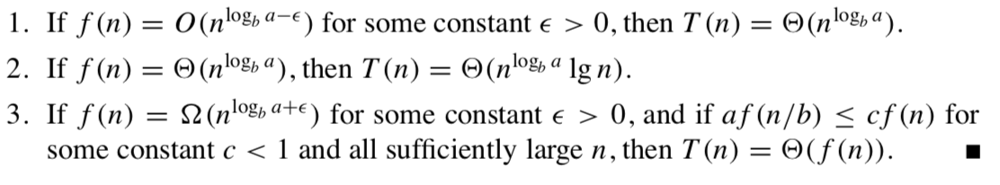
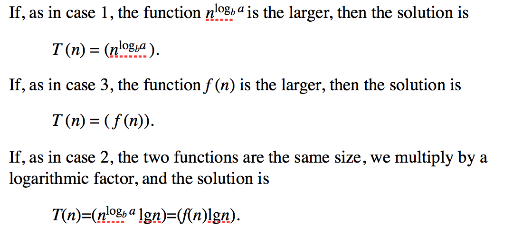
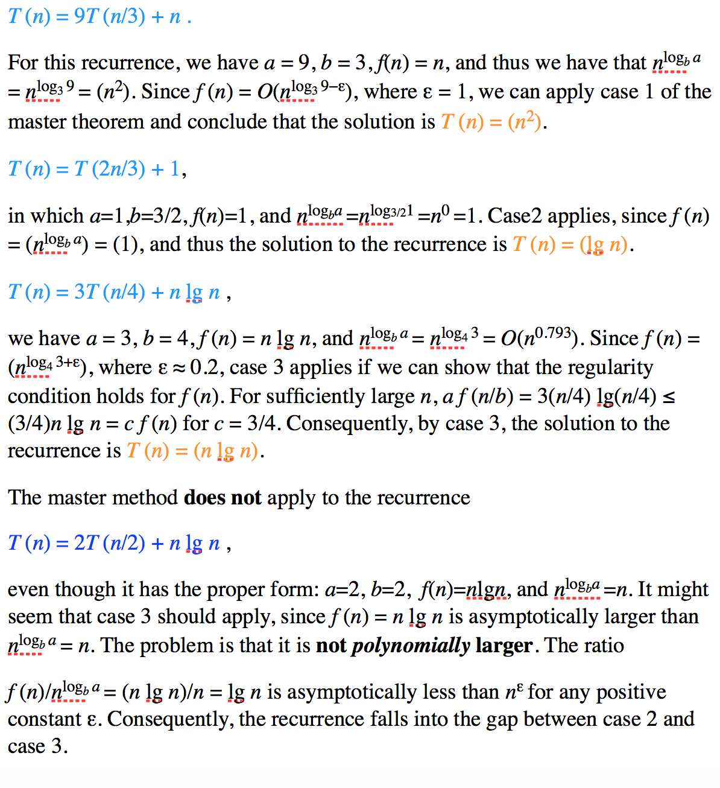

:palm_tree: [Interview Questions](https://kellylin1115.github.io/interview-questions-blog/)

🌿 [Algorithms](index-algorithms.md)

[Master Method](#master-method)

## [Master Method]
The master method provides a “cookbook” method for solving recurrences of the form
T(n)=aT(n/b)+ f(n),
where a ≥ 1 and b > 1 are constants and f (n) is an asymptotically positive function.

Intuitively, the solution to the recurrence is determined by the larger of the two functions.

Using the master method:

