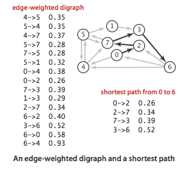
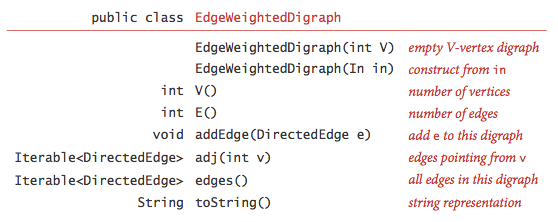
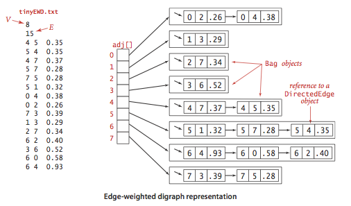

:palm_tree: [Interview Questions](https://kellylin1115.github.io/interview-questions-blog/)

🌿 [Algorithms](index-algorithms.md)

# Graph
## 1. Breadth First Search (BFS)
Breadth First Traversal (or Search) for a graph may contain cycles, so we may come to the same node again. To avoid processing a node more than once, we use a boolean visited array. For simplicity, it is assumed that all vertices are reachable from the starting vertex.

For example, in the following graph, we start traversal from vertex 2. When we come to vertex 0, we look for all adjacent vertices of it. 2 is also an adjacent vertex of 0. If we don’t mark visited vertices, then 2 will be processed again and it will become a non-terminating process. A Breadth First Traversal of the following graph is 2, 0, 3, 1.

:pencil:[BreadthFirstSearchGraph.java](../../../../java/com/kellylin1115/interview/algorithms/graph/BreadthFirstSearchGraph.java)

## 2. Depth First Search (DFS)
Depth First Traversal (or Search) for a graph may contain cycles, so we may come to the same node again. To avoid processing a node more than once, we use a boolean visited array.

For example, in the following graph, we start traversal from vertex 2. When we come to vertex 0, we look for all adjacent vertices of it. 2 is also an adjacent vertex of 0. If we don’t mark visited vertices, then 2 will be processed again and it will become a non-terminating process. A Depth First Traversal of the following graph is 2, 0, 1, 3.

:pencil:[DepthFirstSearchGraph.java](../../../../java/com/kellylin1115/interview/algorithms/graph/DepthFirstSearchGraph.java)

## 3. Shortest Path from source to all vertices **Dijkstra** 
**Shortest paths**: An edge-weighted digraph is a digraph where we associate weights or costs with each edge. A shortest path from vertex s to vertex t is a directed path from s to t with the property that no other such path has a lower weight.

**Weighted edges**:

:pencil:[DirectedEdge.java](../../../../java/com/kellylin1115/interview/algorithms/graph/DirectedEdge.java)

**Edge-weighted digraph**:

:pencil:[EdgeWeightedDigraph.java](../../../../java/com/kellylin1115/interview/algorithms/graph/EdgeWeightedDigraph.java)

**Shortest paths API**:

**Data structures for single-source shortest paths**. Given an edge-weighted digraph and a designated vertex s, a shortest-paths tree (SPT) is a subgraph containing s and all the vertices reachable from s that forms a directed tree rooted at s such that every tree path is a shortest path in the digraph.
We represent the shortest paths with two vertex-indexed arrays:

Edges on the shortest-paths tree: **edgeTo[v]** is the the last edge on a shortest path from s to v.
Distance to the source: **distTo[v]** is the length of the shortest path from s to v.

**Relaxation**. Our shortest-paths implementations are based on an operation known as relaxation. We initialize distTo[s] to 0 and distTo[v] to infinity for all other vertices v.

* Edge relaxation. To relax an edge v->w means to test whether the best known way from s to w is to go from s to v, then take the edge from v to w, and, if so, update our data structures.

    private void relax(DirectedEdge e) {
    
        int v = e.from(), w = e.to();
        if (distTo[w] > distTo[v] + e.weight()) {
            distTo[w] = distTo[v] + e.weight();
            edgeTo[w] = e;
        }
    }

* Vertex relaxation. All of our implementations actually relax all the edges pointing from a given vertex.
    private void relax(EdgeWeightedDigraph G, int v) {
    
        for (DirectedEdge e : G.adj(v)) {
            int w = e.to();
            if (distTo[w] > distTo[v] + e.weight()) {
                distTo[w] = distTo[v] + e.weight();
                edgeTo[w] = e;
            }
        }
    }
    
**Dijkstra's algorithm**. Dijkstra's algorithm initializing dist[s] to 0 and all other distTo[] entries to positive infinity. Then, it repeatedly relaxes and adds to the tree a non-tree vertex with the lowest distTo[] value, continuing until all vertices are on the tree or no non-tree vertex has a finite distTo[] value.

**Proposition**. Dijkstra's algorithm solves the single-source shortest-paths problem in edge-weighted digraphs with nonnegative weights using extra space proportional to V and time proportional to E log V (in the worst case).

:pencil:[DijkstraSP.java](../../../../java/com/kellylin1115/interview/algorithms/graph/DijkstraSP.java)
