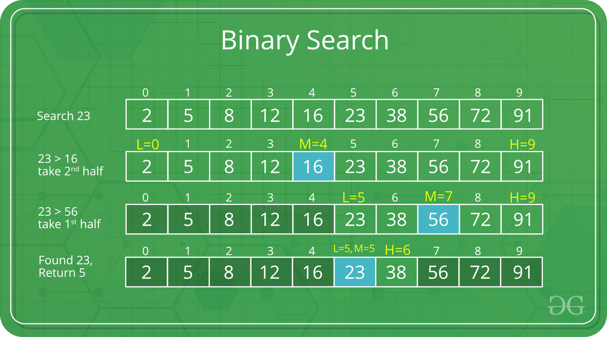
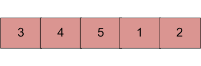
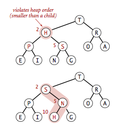

:palm_tree: [Interview Questions](https://kellylin1115.github.io/interview-questions-blog/)

🌿 [Algorithms](index-algorithms.md)

# Sorting And Searching

1. [Binary Search](#binary-search)
2. Search an element in a sorted and rotated array
3. [Bubble Sort](#3-bubble-sort)
4. Insertion Sort
5. Merge Sort
6. Heap Sort (Binary Heap)
7. Quick Sort
8. Interpolation Search
9. Find Kth Smallest/Largest Element In Unsorted Array
10. Given a sorted array and a number x, find the pair in array whose sum is closest to x
11. Index min priority queue

## 1. [Binary Search]
**Binary Search**: Search a sorted array by repeatedly dividing the search interval in half. Begin with an interval covering the whole array. If the value of the search key is less than the item in the middle of the interval, narrow the interval to the lower half. Otherwise narrow it to the upper half. Repeatedly check until the value is found or the interval is empty.

The idea of binary search is to use the information that the array is sorted and reduce the time complexity to O(Log n)

:pencil:[BinarySearch.java](../../../../java/com/kellylin1115/interview/algorithms/sortingsearching/BinarySearch.java)

## 2. Search an element in a sorted and rotated array
An element in a sorted array can be found in O(log n) time via **binary search**. But suppose we rotate an ascending order sorted array at some pivot unknown to you beforehand. So for instance, 1 2 3 4 5 might become 3 4 5 1 2. Devise a way to find an element in the rotated array in O(log n) time.

Input  : arr[] = {5, 6, 7, 8, 9, 10, 1, 2, 3};
         key = 3
Output : Found at index 8

Input  : arr[] = {5, 6, 7, 8, 9, 10, 1, 2, 3};
         key = 30
Output : Not found

Input : arr[] = {30, 40, 50, 10, 20}
        key = 10   
Output : Found at index 3

**Solution**:

1) Find middle point mid = (l + h)/2

2) **If** key is present at middle point, return mid.

3) **Else If** arr[l..mid] is sorted

    a) If key to be searched lies in range from arr[l]
       to arr[mid], recur for arr[l..mid].
       
    b) Else recur for arr[mid+1..h]
    
4) **Else** (arr[mid+1..h] must be sorted)

    a) If key to be searched lies in range from arr[mid+1]
       to arr[h], recur for arr[mid+1..h].
       
    b) Else recur for arr[l..mid] 

:pencil:[SortedRotatedSearch.java](../../../../java/com/kellylin1115/interview/algorithms/sortingsearching/SortedRotatedSearch.java)

## [3 Bubble Sort]
Bubble Sort is the simplest sorting algorithm that works by repeatedly swapping the adjacent elements if they are in wrong order.

Example:

**First Pass**:

    ( 5 1 4 2 8 ) –> ( 1 5 4 2 8 ), Here, algorithm compares the first two elements, and swaps since 5 > 1.
    ( 1 5 4 2 8 ) –> ( 1 4 5 2 8 ), Swap since 5 > 4
    ( 1 4 5 2 8 ) –> ( 1 4 2 5 8 ), Swap since 5 > 2
    ( 1 4 2 5 8 ) –> ( 1 4 2 5 8 ), Now, since these elements are already in order (8 > 5), algorithm does not swap them.

**Second Pass**:

    ( 1 4 2 5 8 ) –> ( 1 4 2 5 8 )
    ( 1 4 2 5 8 ) –> ( 1 2 4 5 8 ), Swap since 4 > 2
    ( 1 2 4 5 8 ) –> ( 1 2 4 5 8 )
    ( 1 2 4 5 8 ) –> ( 1 2 4 5 8 )

Now, the array is already sorted, but our algorithm does not know if it is completed. The algorithm needs one whole pass without any swap to know it is sorted.

**Third Pass**:

    ( 1 2 4 5 8 ) –> ( 1 2 4 5 8 )
    ( 1 2 4 5 8 ) –> ( 1 2 4 5 8 )
    ( 1 2 4 5 8 ) –> ( 1 2 4 5 8 )
    ( 1 2 4 5 8 ) –> ( 1 2 4 5 8 )

:pencil:[BubbleSort.java](../../../../java/com/kellylin1115/interview/algorithms/sortingsearching/BubbleSort.java)

**Worst and Average Case Time Complexity**: O(n*n). Worst case occurs when array is reverse sorted.

**Best Case Time Complexity**: O(n). Best case occurs when array is already sorted.

**Auxiliary Space**: O(1)

**Sorting In Place**: Yes

**Stable**: Yes

## 4. Insertion Sort
Insertion sort is a simple sorting algorithm that works the way we sort playing cards in our hands.

**Solution**:

    // Sort an arr[] of size n
    Loop from i = 1 to n-1.
        Pick element arr[i] and insert it into sorted sequence arr[0…i-1]

:pencil:[InsertionSort.java](../../../../java/com/kellylin1115/interview/algorithms/sortingsearching/InsertionSort.java)

**Time Complexity**: O(n*2)

**Auxiliary Space**: O(1)

**Boundary Cases**: Insertion sort takes maximum time to sort if elements are sorted in reverse order. And it takes minimum time (Order of n) when elements are already sorted.

**Sorting In Place**: Yes

**Stable**: Yes

**Uses**: Insertion sort is used when number of elements is small. It can also be useful when input array is almost sorted, only few elements are misplaced in complete big array.

## 11. Index min priority queue
**Heap definitions**. The binary heap is a data structure that can efficiently support the basic priority-queue operations. In a binary heap, the items are stored in an array such that each key is guaranteed to be larger than (or equal to) the keys at two other specific positions

A binary heap is a set of nodes with keys arranged in a complete heap-ordered binary tree, represented in level order in an array (not using the first entry).

In a heap, the parent of the node in position k is in position k/2; and, conversely, the two children of the node in position k are in positions 2k and 2k + 1. 

**Algorithms on heaps**. We represent a heap of size n in private array pq[] of length n + 1, with pq[0] unused and the heap in pq[1] through pq[n].

* Bottom-up reheapify (swim). If the heap order is violated because a node's key becomes larger than that node's parents key, then we can make progress toward fixing the violation by exchanging the node with its parent. After the exchange, the node is larger than both its children (one is the old parent, and the other is smaller than the old parent because it was a child of that node) but the node may still be larger than its parent. We can fix that violation in the same way, and so forth, moving up the heap until we reach a node with a larger key, or the root. Bottom-up heapify (swim)
 
   
 
    private void swim(int k) {
       while (k > 1 && less(k/2, k)) {
          exch(k, k/2);
          k = k/2;
       }
    }

* Top-down heapify (sink). If the heap order is violated because a node's key becomes smaller than one or both of that node's children's keys, then we can make progress toward fixing the violation by exchanging the node with the larger of its two children. This switch may cause a violation at the child; we fix that violation in the same way, and so forth, moving down the heap until we reach a node with both children smaller, or the bottom

 

    private void sink(int k) {
       while (2*k <= N) {
          int j = 2*k;
          if (j < N && less(j, j+1)) j++;
          if (!less(k, j)) break;
          exch(k, j);
          k = j;
       }
    }
    
**Heap-based priority queue**. 
* Insert. We add the new item at the end of the array, increment the size of the heap, and then swim up through the heap with that item to restore the heap condition.
* Remove the maximum. We take the largest item off the top, put the item from the end of the heap at the top, decrement the size of the heap, and then sink down through the heap with that item to restore the heap condition.

 

In an n-item priority queue, the heap algorithms require no more than 1 + lg n compares for **insert** and no more than 2 lg n compares for **remove** the maximum.

**Index priority queue**. In many applications, it makes sense to allow clients to refer to items that are already on the priority queue. One easy way to do so is to associate a unique integer index with each item.

 

:pencil:[IndexMinPQ.java](../../../../java/com/kellylin1115/interview/algorithms/sortingsearching/IndexMinPQ.java)

