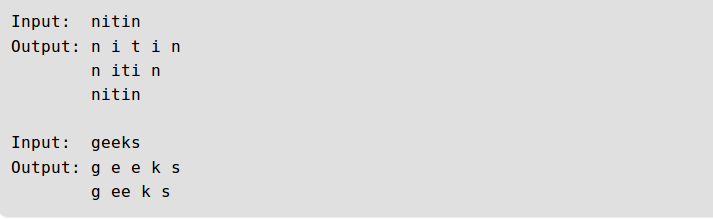

:palm_tree: [Interview Questions](https://kellylin1115.github.io/interview-questions-blog/)

🌿 [Algorithms](index-algorithms.md)

# String / Array

1. [Reverse an array without affecting special characters](#1)
2. [All Possible Palindromic Partitions](#2-all-possible-palindromic-partitions)

## [1]
## [Reverse an array without affecting special characters]
Given a string, that contains special character together with alphabets (‘a’ to ‘z’ and ‘A’ to ‘Z’), reverse the string in a way that special characters are not affected.

Examples:

    Input:   str = "a,b$c"
    Output:  str = "c,b$a"
    Note that $ and , are not moved anywhere.  
    Only subsequence "abc" is reversed
    
    Input:   str = "Ab,c,de!$"
    Output:  str = "ed,c,bA!$"
    
**Solution**:

    1) Let input string be 'char[] str' and length of string be 'n'
    2) l = 0, r = n-1
    3) While l is smaller than r, do following
        a) If str[l] is not an alphabetic character, do l++
        b) Else If str[r] is not an alphabetic character, do r--
        c) Else swap str[l] and str[r]
    
:pencil:[ReverseWithoutSpecial.java](../../../../java/com/kellylin1115/interview/algorithms/stringarray/ReverseWithoutSpecial.java)

## [2 All Possible Palindromic Partitions]
Given a string, find all possible palindromic partitions of given string.

Example:

We have to list the all possible partitions so we will think in the direction of recursion. When we are on index i, we incrementally check all substrings starting from i for being palindromic. If found, we recursively solve the problem for the remaining string and add this in our solution.

**Solution**:

1. We will maintain a 2-dimensional vector for storing all possible partitions and a temporary vector for storing the current partition, new starting index of string to check partitions as we have already checked partitions before this index.
2. Now keep on iterating further on string and check if it is palindrome or not.
3. If it is a palindrome than add this string in current partitions vector. Recurse on this new string if it is not the end of the string. After coming back again change the current partition vector to the old one as it might have changed in the recursive step.
4. If we reach the end of string while iterating than we have our partitions in our temporary vector so we will add it in results.

:pencil:[PrintAllPalindrome.java](../../../../java/com/kellylin1115/interview/algorithms/stringarray/PrintAllPalindrome.java)

