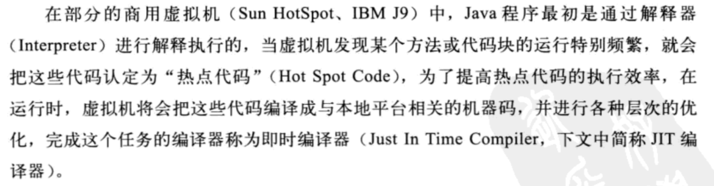
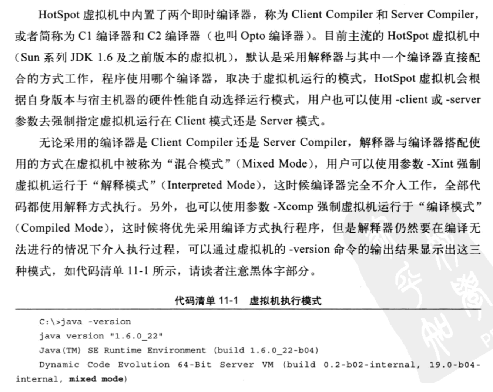
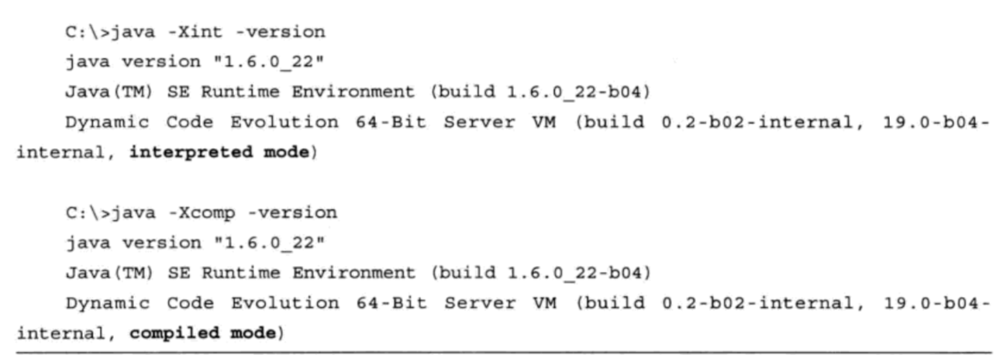

:palm_tree: [Interview Questions](https://kellylin1115.github.io/interview-questions-blog/)

# Java Interview Basic

## 1. Explain JDK, JRE and JVM?

JDK | JRE | JVM
------ | ------ | ------
It stands for Java Development Kit | It stands for Java Runtime Environment | It stands for Java Virtual Machine
It is the tool necessary to compile, document and package Java programs | JRE refers to a runtime environment in which Java bytecode can be executed | It is an abstract machine. It is a specification that provides a run-time environment in which Java bytecode can be executed
It contains JRE + development tools | It’s an implementation of the JVM which physically exists | JVM follows three notations: Specification, Implementation, and Runtime Instance

## 2. Explain public static void main(String[] args) in Java.
main() in Java is the entry point for any Java program. It is always written as **public static void main(String[] args)**.

* **public**: Public is an access modifier, which is used to specify who can access this method. Public means that this Method will be accessible by any Class.
* **static**: It is a keyword in java which identifies it is class-based. main() is made static in Java so that it can be accessed without creating the instance of a Class. In case, main is not made static then the compiler will throw an error as main() is called by the JVM before any objects are made and only static methods can be directly invoked via the class. 
* **void**: It is the return type of the method. Void defines the method which will not return any value.
* **main**: It is the name of the method which is searched by JVM as a starting point for an application with a particular signature only. It is the method where the main execution occurs.
* **String[] args**: It is the parameter passed to the main method.

## 3.  Why Java is platform independent?
Java is called platform independent because of its byte codes which can run on any system irrespective of its underlying operating system.

## 4.  Why Java is not 100% Object-oriented?
Java is not 100% Object-oriented because it makes use of eight primitive data types such as boolean, byte, char, int, float, double, long, short which are not objects.

## 5. What are wrapper classes in Java?
Wrapper classes convert the Java primitives into the reference types (objects). Every primitive data type has a wrapper class dedicated to it. 

## 6. What are constructors in Java?
In Java, constructor refers to a block of code which is used to initialize an object. It must have the same name as that of the class. Also, it has no return type and it is automatically called when an object is created.

There are two types of constructors:

**Default Constructor**: In Java, a default constructor is the one which does not take any inputs. In other words, default constructors are the no argument constructors which will be created by default in case no other constructor is defined by the user. Its main purpose is to initialize the instance variables with the default values. Also, it is majorly used for object creation. 

**Parameterized Constructor**: The parameterized constructor in Java, is the constructor which is capable of initializing the instance variables with the provided values. In other words, the constructors which take the arguments are called parameterized constructors.

## 7. What is singleton class in Java and how can we make a class singleton?
Singleton class is a class whose only one instance can be created at any given time, in one JVM. A class can be made singleton by making its constructor private.

## 8. What is the difference between Array list and vector in Java?

ArrayList |	Vector
---------- | ----------
Array List is not synchronized.	| Vector is synchronized.
Array List is fast as it’s non-synchronized.	| Vector is slow as it is thread safe.
If an element is inserted into the Array List, it increases its Array size by 50%.	| Vector defaults to doubling size of its array.
Array List does not define the increment size.	| Vector defines the increment size.
Array List can only use Iterator for traversing an Array List.	| Vector can use both Enumeration and Iterator for traversing.

## 9. What is the difference between equals() and == in Java?
Equals() method is defined in Object class in Java and used for checking equality of two objects defined by business logic.

“==” or equality operator in Java is a binary operator provided by Java programming language and used to compare primitives and objects. public boolean equals(Object o) is the method provided by the Object class. The default implementation uses == operator to compare two objects. For example: method can be overridden like String class. equals() method is used to compare the values of two objects.

## 10. What are the differences between Heap and Stack Memory in Java?

Feature	| Stack	| Heap
-------- | ------ | ------
**Memory**	| Stack memory is used only by one thread of execution.	| Heap memory is used by all the parts of the application.
**Access** | Stack memory can’t be accessed by other threads.	| Objects stored in the heap are globally accessible.
**Memory Management**	| Follows LIFO manner to free memory. |	Memory management is based on the generation associated with each object.
**Lifetime** | Exists until the end of execution of the thread.	| Heap memory lives from the start till the end of application execution.
**Usage**	| Stack memory only contains local primitive and reference variables to objects in heap space.	| Whenever an object is created, it’s always stored in the Heap space.

## 11. What is a package in Java? List down various advantages of packages.
Packages in Java, are the collection of related classes and interfaces which are bundled together. By using packages, developers can easily modularize the code and optimize its reuse. Also, the code within the packages can be imported by other classes and reused. Below I have listed down a few of its advantages:

* Packages help in avoiding name clashes
* They provide easier access control on the code
* Packages can also contain hidden classes which are not visible to the outer classes and only used within the package
* Creates a proper hierarchical structure which makes it easier to locate the related classes

## 12. Why pointers are not used in Java?
Java doesn’t use pointers because they are unsafe and increases the complexity of the program. Since, Java is known for its simplicity of code, adding the concept of pointers will be contradicting. Moreover, since JVM is responsible for implicit memory allocation, thus in order to avoid direct access to memory by the user,  pointers are discouraged in Java.

## 13. What is JIT compiler in Java?
JIT stands for Just-In-Time compiler in Java. It is a program that helps in converting the Java bytecode into instructions that are sent directly to the processor. By default, the JIT compiler is enabled in Java and is activated whenever a Java method is invoked. The JIT compiler then compiles the bytecode of the invoked method into native machine code, compiling it “just in time” to execute. Once the method has been compiled, the JVM summons the compiled code of that method directly rather than interpreting it. This is why it is often responsible for the performance optimization of Java applications at the run time.

## 14. What are access modifiers in Java?
In Java, access modifiers are special keywords which are used to restrict the access of a class, constructor, data member and method in another class. Java supports four types of access modifiers:

1. Private
2. Default
3. Protected
4. Public

**Modifier** | **Private** | **Default** | **Protected** |	**Public**
------------ | ----------- | ----------- | ------------- | -----------
Same class |	YES |	YES |	YES |	YES
Same Package subclass	| NO	| YES	| YES |	YES
Same Package non-subclass |	NO	| YES | YES | YES
Different package subclass | NO |	NO | YES | YES
Different package non-subclass | NO |	NO | NO |	YES

## 15. What is an object in Java and how is it created?
An object is a real-world entity that has a state and behavior. An object has three characteristics:

1. State
2. Behavior
3. Identity

An object is created using the ‘new’ keyword. For example:

ClassName obj = new ClassName();

## 16. What is Object Oriented Programming?
Object-oriented programming or popularly known as OOPs is a programming model or approach where the programs are organized around objects rather than logic and functions. In other words, OOP mainly focuses on the objects that are required to be manipulated instead of logic. This approach is ideal for the programs large and complex codes and needs to be actively updated or maintained.

## 17.  What are the main concepts of OOPs in Java?
Object-Oriented Programming or OOPs is a programming style that is associated with concepts like:
1. Inheritance: Inheritance is a process where one class acquires the properties of another.
2. Encapsulation: Encapsulation in Java is a mechanism of wrapping up the data and code together as a single unit.
3. Abstraction: Abstraction is the methodology of hiding the implementation details from the user and only providing the functionality to the users. 
4. Polymorphism: Polymorphism is the ability of a variable, function or object to take multiple forms.

## 18. What is the difference between a local variable and an instance variable?
In Java, a local variable is typically used inside a method, constructor, or a block and has only local scope. Thus, this variable can be used only within the scope of a block. The best benefit of having a local variable is that other methods in the class won’t be even aware of that variable.

An instance variable is bounded to its object itself. These variables are declared within a class, but outside a method. Every object of that class will create it’s own copy of the variable while using it. Thus, any changes made to the variable won’t reflect in any other instances of that class and will be bound to that particular instance only.

## 19. Differentiate between the constructors and methods in Java?

Methods |	Constructors
------- | ------------
Used to represent the behavior of an object	| Used to initialize the state of an object
Must have a return type	| Do not have any return type
Needs to be invoked explicitly	| Is invoked implicitly
No default method is provided by the compiler	| A default constructor is provided by the compiler if the class has none
Method name may or may not be same as class name	| Constructor name must always be the same as the class name

## 20. What is final keyword in Java?
final is a special keyword in Java that is used as a non-access modifier. A final variable can be used in different contexts such as:

**final variable**:
When the final keyword is used with a variable then its value can’t be changed once assigned. In case the no value has been assigned to the final variable then using only the class constructor a value can be assigned to it.

**final method**:
When a method is declared final then it can’t be overridden by the inheriting class.

**final class**:
When a class is declared as final in Java, it can’t be extended by any subclass class but it can extend other class.

## 21. What is the difference between break and continue statements?

break |	continue
------ | --------
Can be used in switch and loop (for, while, do while) statements	| Can be only used with loop statements
It causes the switch or loop statements to terminate the moment it is executed	| It doesn’t terminate the loop but causes the loop to jump to the next iteration

## 22. What is the difference between this() and super() in Java?
In Java, super() and this(), both are special keywords that are used to call the constructor. 

this()	| super()
------- | -------
this() represents the current instance of a class	| super() represents the current instance of a parent class
Used to call the default constructor of the same class and must be the first statement in constructor body | Used to call the default constructor of the parent class must be the first statement in constructor body
Used to access methods of the current class	| Used to access methods of the parent class

## 23. What is Java String Pool?
Java String pool refers to a collection of Strings which are stored in heap memory. Whenever a new object is created, String pool first checks whether the object is already present in the pool or not. If it is present, then the same object is returned to the variable else new object will be created in the String pool and the respective reference will be returned.

* String s1 = "Apple";
* String s2 = new String("Apple");
* String s3 = new String("Apple");
* s1 == s3: false
* s2 == s3: false

## 24. What is constructor chaining in Java?
In Java, constructor chaining is the process of calling one constructor from another with respect to the current object. Constructor chaining is possible only through legacy where a subclass constructor is responsible for invoking the superclass’ constructor first. There could be any number of classes in the constructor chain. Constructor chaining can be achieved in two ways:

1. Within the same class using this()
2. From base class using super()

## 25. Difference between String, String Builder, and String Buffer.

Factor |	String | String Builder | String Buffer
------ | ------- | ------------- | -------------
Storage Area |	Constant String Pool|	Heap Area	| Heap Area
Mutability	| Immutable	| Mutable |	Mutable |
Thread Safety |	Yes	| No	| Yes
Performance	| Fast | Fast	| Slow

## 26. What is a classloader in Java?
The **Java ClassLoader** is a subset of JVM (Java Virtual Machine) that is responsible for loading the class files. Whenever a Java program is executed it is first loaded by the classloader. Java provides three built-in classloaders:

1. **Bootstrap ClassLoader**: This is the first classloader which is the superclass of Extension classloader. It loads the rt.jar file which contains all class files of Java Standard Edition like java.lang package classes, java.net package classes, java.util package classes, java.io package classes, java.sql package classes, etc.
2. **Extension ClassLoader**: This is the child classloader of Bootstrap and parent classloader of System classloader. It loads the jar files located inside $JAVA_HOME/jre/lib/ext directory.
3. **System/Application ClassLoader**: This is the child classloader of Extension classloader. It loads the class files from the classpath. By default, the classpath is set to the current directory. You can change the classpath using "-cp" or "-classpath" switch. It is also known as Application classloader.

## 27. Why Java Strings are immutable in nature?
In Java, string objects are immutable in nature which simply means once the String object is created its state cannot be modified. Whenever you try to update the value of that object instead of updating the values of that particular object, Java creates a new string object. Java String objects are immutable as String objects are generally cached in the String pool. Since String literals are usually shared between multiple clients, action from one client might affect the rest. It enhances security, caching, synchronization, and performance of the application. 

## 28. What is the difference between an array and an array list?

Array | ArrayList
----- | --------- 
Cannot contain values of different data types	| Can contain values of different data types.
Size must be defined at the time of declaration	| Size can be dynamically changed
Need to specify the index in order to add data	| No need to specify the index
Arrays are not type parameterized | Arraylists are type parameterized
Arrays can contain primitive data types as well as objects | Arraylists can contain only objects, no primitive data types are allowed

## 29. How many types of memory areas are allocated by JVM?

**Method Area**: Method Area stores per-class structures such as the runtime constant pool, field, method data, and the code for methods.

**Heap**: It is the runtime data area in which the memory is allocated to the objects

**Stack**: Java Stack stores frames. It holds local variables and partial results, and plays a part in method invocation and return. Each thread has a private JVM stack, created at the same time as the thread. A new frame is created each time a method is invoked. A frame is destroyed when its method invocation completes.

**Program Counter Register**: PC (program counter) register contains the address of the Java virtual machine instruction currently being executed.

**Native Method Stack**: It contains all the native methods used in the application.

## 30. What is JIT compiler?
Just-In-Time (JIT) compiler compiles the byte code of that method into native machine code to improve the performance of Java applications at run time. When a method has been compiled, the JVM calls the compiled code of that method directly instead of interpreting it.

 

**解释器与编译器**：
* 当程序需要迅速启动和执行的时候，解释器可以省去编译的时间， 立即执行。
* 当程序运行后，随着时间的推移， 编译器把越来越多的代码编译成本地代码后， 可以获得更高的执行效率。
* 当程序运行环境中内存资源限制较大， 可以使用解释执行节约内存， 反之可以使用编译执行提升效率。
* 解释器还可以作为编译器激进优化时的一个"逃生门"， 让编译器根据概率选择一些大多数都能提升运行速度的优化手段， 当激进优化的假设不成立，如加载了新类后类型继承结构出现变化，出现"罕见陷阱"（Uncommon Trap）时可以通过逆优化（Deoptimization）退回到解释状态继续执行。

 

 

## 31. Can we make the abstract methods static in Java?
In Java, if we make the abstract methods static, It will become the part of the class, and we can directly call it which is unnecessary. Calling an undefined method is completely useless therefore it is not allowed.

## 32. Can we declare the static variables and methods in an abstract class?
Yes, we can declare static variables and methods in an abstract method. As we know that there is no requirement to make the object to access the static context, therefore, we can access the static context declared inside the abstract class by using the name of the abstract class.

## 33. Can we assign the reference to this variable?
No, this cannot be assigned to any value because it always points to the current class object and this is the **final** reference in Java. However, if we try to do so, the compiler error will be shown.

## 34.  What is aggregation?
Aggregation can be defined as the relationship between two classes where the aggregate class **contains a reference** to the class it owns. Aggregation is best described as a **has-a** relationship. 

## 35. What is composition?
Holding the reference of a class within some other class is known as composition. When an object contains the other object, if the contained object **cannot** exist without the existence of container object, then it is called composition. In other words, we can say that composition is the **particular case of aggregation** which represents a **stronger** relationship between two objects. 

## 36. What is the difference between aggregation and composition?
Aggregation represents the weak relationship whereas composition represents the strong relationship. For example, the bike has an indicator (aggregation), but the bike has an engine (composition).

## 37. Can you use this() and super() both in a constructor?
No, because this() and super() must be the **first** statement in the class constructor.

## 38. Can we override the private methods?
No, we cannot override the private methods because the scope of private methods is limited to the class and we cannot access them outside of the class.

## 39. Can we change the scope of the overridden method in the subclass?
Yes, we can change the scope of the overridden method in the subclass. However, we must notice that we **cannot decrease** the accessibility of the method. The following point must be taken care of while changing the accessibility of the method.

* The private can be changed to protected, public, or default.
* The protected can be changed to public or default.
* The default can be changed to public.
* The public will always remain public.

## 40. Can we modify the throws clause of the superclass method while overriding it in the subclass?
Yes, we can modify the throws clause of the superclass method while overriding it in the subclass. However, there are some rules which are to be followed while overriding in case of exception handling.

* If the superclass method does not declare an exception, subclass overridden method cannot declare the checked exception, but it can declare the unchecked exception.
* If the superclass method declares an exception, subclass overridden method can declare same, subclass exception or no exception but cannot declare parent exception.

## 41. What is the abstract class?
A class that is declared as **abstract** is known as an abstract class. It needs to be extended and its method implemented. It **cannot** be instantiated. It can **have** abstract methods, non-abstract methods, **constructors**, and static methods.

## 42. Can you use abstract and final both with a method?
No, because we need to override the abstract method to provide its implementation, whereas we can't override the final method.

## 43.  What is the interface?
The interface is a blueprint for a class that has **static constants** and **abstract methods**. It can be used to achieve **full abstraction** and **multiple inheritance**. It is a mechanism to achieve abstraction. There can be only abstract methods in the Java interface, not method body. It **cannot be instantiated** just like the abstract class. However, we need to implement it to define its methods. Since Java 8, we can have the default, static, and private methods in an interface.

## 44. Can you declare an interface method static?
No, because methods of an interface are abstract by default, and we can not use static and abstract together.

## 45. Can the Interface be final?
No, because an interface needs to be implemented by the other class and if it is final, it can't be implemented by any class.

## 46. How to create packages in Java
* If you are using the programming IDEs like Eclipse, NetBeans, MyEclipse, etc. click on file->new->project and eclipse will ask you to enter the name of the package. It will create the project package containing various directories such as src, etc. 
* If you are using an editor like notepad for java programming, use the following steps to create the package.
    
    1. **Define** a **package** package_name in you class. Create the class with the name class_name and save this file with class_name.java.
    
    2. Now compile the file by running the following command on the terminal.
    
        javac -d . your_class_name.java  
    
        The above command creates the package with the name package_name in the present working directory.
    
    3. Now, run the class file by using the absolute class file name, like following.
        
        java package_name.class_name  
        
## 47. Do I need to import java.lang package any time? Why?
No. It is by **default** loaded internally by the JVM.

## 48. What is String Pool?
String pool is the space reserved in the heap memory that can be used to store the strings. The main advantage of using the String pool is whenever we create a string literal; the JVM checks the "string constant pool" first. If the string already exists in the pool, a reference to the pooled instance is returned. If the string doesn't exist in the pool, a new string instance is created and placed in the pool. Therefore, it saves the memory by avoiding the duplicacy.

## 49. How many ways can we create the string object?
1) String Literal

    Java String literal is created by using double quotes. For Example:
    
    String s="welcome";  
    Each time you create a string literal, the JVM checks the "string constant pool" first. If the string already exists in the pool, a reference to the pooled instance is returned. If the string doesn't exist in the pool, a new string instance is created and placed in the pool. String objects are stored in a special memory area known as the string constant pool For example:
    
    String s1="Welcome";  
    String s2="Welcome";//It **doesn't** create a new instance  

2) By new keyword

    String s=new String("Welcome");//creates **two** objects and one reference variable  
    
    In such case, JVM will create a new string object in normal (non-pool) heap memory, and the literal "Welcome" will be placed in the constant string pool. The variable s will refer to the object in a heap (non-pool)
    
## 50. Regular expressions
In Java, ‘ \ \ ‘ means "I’m inserting a regular expression backslash, so that the following character has special meaning." For example, if you want to indicate a digit, your regular expression string will be ‘\\d’. If you want to insert a literal backslash, you say ‘\\\\’- However, things like newlines and tabs just use a single backslash: ‘\n\t’.

    System.out.println("+911".matches("(-|\\+)?\\d+")); --> true

    (-|\\+)? means that this part of the string may be either a ‘-’ or a ‘+’ or nothing (because of the ‘?’). Because the ‘+’ character has special meaning in regular expressions, it must be escaped with a ‘\\’ in order to appear as an ordinary character in the expression.

**Pattern** and **Matcher**
* compile a regular expression by using the static Pattern.compile( ) method. This produces a Pattern object based on its String argument. 
* You use the Pattern by calling the matcher( ) method, passing the string that you want to search. 
* The matcher( ) method produces a Matcher object, which has a set of operations to choose from

      Pattern p = Pattern.compile(...);
      Matcher m = p.matcher(...);
      while(m.find()) {
           print("Match \"" + m.group() + "\" at positions " +
           m.start() + "-" + (m.end() - 1));
      }
      
public int **start**(int group) returns the start index of the group found in the previous match operation.

public int **end**(int group) returns the index of the last character, **plus one**, of the group found in the previous match operation.

## 51. Can we access the non-final local variable, inside the local inner class?
No, the local variable **must be constant** if you want to access it in the local inner class.

## 52. What is the nested interface?
An **Interface** that is declared **inside** the **interface** or **class** is known as the **nested interface**. It is **static by default**. The nested interfaces are used to group related interfaces so that they can be easy to maintain. The external interface or class must refer to the nested interface. It **can't** be accessed directly. The nested interface **must be public** if it is declared **inside the interface** but it can have **any access modifier** if declared **within the class**. The syntax of the nested interface is given as follows.

Example of nested interface which is declared **within the interface**

    interface Showable{  
      void show();  
      interface Message{  
       void msg();  
      }  
    }  
    class TestNestedInterface1 implements Showable.Message{  
     public void msg(){System.out.println("Hello nested interface");}  
      
     public static void main(String args[]){  
      Showable.Message message=new TestNestedInterface1();//upcasting here  
      message.msg();  
     }  
    }  
    
Example of nested interface which is declared **within the class**

    class A{  
      interface Message{  
       void msg();  
      }  
    }  
      
    class TestNestedInterface2 implements A.Message{  
     public void msg(){System.out.println("Hello nested interface");}  
      
     public static void main(String args[]){  
      A.Message message=new TestNestedInterface2();//upcasting here  
      message.msg();  
     }  
    }  
    
## 53. Can an Interface have a class?
Yes, they are **static** implicitly.

## 54. What do you understand by an IO stream?
The stream is **a sequence of data** that flows from source to destination. It is composed of **bytes**. Java provides the following three standard streams −

* Standard Input − This is used to **feed the data** to user's **program** and usually a **keyboard** is used as standard input stream and represented as System.in.

* Standard Output − This is used to **output the data** produced by the user's **program** and usually a **computer screen** is used for standard output stream and represented as System.out.

* Standard Error − This is used to **output the error data** produced by the user's program and usually a **computer screen** is used for standard error stream and represented as System.err.

## 55. What is the difference between the Reader/Writer class hierarchy and the InputStream/OutputStream class hierarchy?
The **Reader/Writer** class hierarchy is **character-oriented**, and the **InputStream/OutputStream** class hierarchy is **byte-oriented**. The ByteStream classes are used to perform input-output of 8-bit bytes whereas the CharacterStream classes are used to perform the input/output for the 16-bit Unicode system. There are many classes in the ByteStream class hierarchy, but the most frequently used classes are **FileInputStream** and **FileOutputStream**. The most frequently used classes CharacterStream class hierarchy is **FileReader** and **FileWriter**.

## 56. What are the super most classes for all the streams?
All the stream classes can be divided into two types of classes that are **ByteStream** classes and **CharacterStream** Classes. The ByteStream classes are further divided into **InputStream** classes and **OutputStream** classes. CharacterStream classes are also divided into **Reader** classes and **Writer** classes. 
The SuperMost classes for all the InputStream classes is java.io.InputStream and for all the output stream classes is java.io.OutPutStream. Similarly, for all the reader classes, the super-most class is java.io.Reader, and for all the writer classes, it is java.io.Writer.

## 57. What are the FileInputStream and FileOutputStream?
Java FileOutputStream is an output stream used for writing data to a file. If you have some primitive values to write into a file, use FileOutputStream class. You can write byte-oriented as well as character-oriented data through the FileOutputStream class. However, for character-oriented data, it is preferred to use FileWriter than FileOutputStream. 

Java FileInputStream class obtains input bytes from a file. It is used for reading byte-oriented data (streams of raw bytes) such as image data, audio, video, etc. You can also read character-stream data. However, for reading streams of characters, it is recommended to use FileReader class.

    public static void main(String args[]) throws IOException {
          FileReader in = null;
          FileWriter out = null;
    
          try {
             in = new FileReader("input.txt");
             out = new FileWriter("output.txt");
             
             int c;
             while ((c = in.read()) != -1) {
                out.write(c);
             }
          }finally {
             if (in != null) {
                in.close();
             }
             if (out != null) {
                out.close();
             }
          }
       }

## 58. What is the purpose of using BufferedInputStream and BufferedOutputStream classes?
Java BufferedOutputStream class is used for buffering an output stream. It internally uses a buffer to store data. It adds more efficiency than to write data directly into a stream. So, it makes the performance fast. Whereas, Java BufferedInputStream class is used to read information from the stream. It internally uses the buffer mechanism to make the performance fast.

:pencil:[CopyFile.java](../../../../java/com/kellylin1115/interview/java/basic/CopyFile.java)

## 59. What is serialization?
Serialization in Java is a mechanism of writing the state of an object into a **byte stream**. It is used primarily in Hibernate, RMI, JPA, EJB and JMS technologies. It is mainly used to **travel object's state on the network** (which is known as marshaling). **Serializable interface** is used to perform serialization. It is helpful when you require to save the state of a program to storage such as the file. At a later point of time, the content of this file can be **restored** using **deserialization**.

## 60. How can you avoid serialization in child class if the base class is implementing the Serializable interface?
It is very tricky to prevent serialization of child class if the base class is intended to implement the Serializable interface. However, we cannot do it directly, but the serialization can be avoided by implementing the writeObject() or readObject() methods in the subclass and throw NotSerializableException from these methods. 

    class Person implements Serializable {
        String name = " ";
        public Person(String name) {
            this.name = name;
        }
    }
    
    class Employee extends Person {
        float salary;
        public Employee(String name, float salary) {
            super(name);
            this.salary = salary;
        }
        
        private void writeObject(ObjectOutputStream out) throws IOException {
            throw new NotSerializableException();
        }
        private void readObject(ObjectInputStream in) throws IOException {
            throw new NotSerializableException();
        }
    } 

## 61. What is Deserialization?
Deserialization is the process of reconstructing the object from the serialized state. It is the reverse operation of serialization. An ObjectInputStream deserializes objects and primitive data written using an ObjectOutputStream

    ObjectInputStream in=new ObjectInputStream(new FileInputStream("f.txt"));  
    Student s=(Student)in.readObject();  
    in.close();
    
## 62.  What is the transient keyword?
If you define any data member as transient, it will not be serialized.

## 63. What is Externalizable?
The Externalizable interface is used to write the state of an object into a byte stream in a compressed format. It is not a marker interface.
It contains two methods, i.e., writeExternal() and readExternal().
We must call a public default constructor while using this interface.
The Externalizable interface provides control of the serialization logic to the programmer.

:pencil:[Person.java](../../../../java/com/kellylin1115/interview/java/basic/Person.java)

## 64. Give a brief description of Java socket programming?
Java Socket programming is used for **communication** between the applications running on **different JRE**. Java Socket programming can be **connection-oriented** or **connectionless**. Socket and ServerSocket classes are used for connection-oriented socket programming and DatagramSocket, and DatagramPacket classes are used for connectionless socket programming. The client in socket programming must know two information:
* IP address of the server
* port number

## 65. What is Socket?
A socket is simply an **endpoint** for **communications** between the **machines**. It provides the connection mechanism to connect the two computers using **TCP**. The Socket class can be used to create a socket.

## 66. What are the steps that are followed when two computers connect through TCP?
There are the following steps that are performed when two computers connect through TCP.

* The ServerSocket object is instantiated by the server which denotes the port number to which, the connection will be made.
* After instantiating the ServerSocket object, the server invokes accept() method of ServerSocket class which makes server wait until the client attempts to connect to the server on the given port.
* Meanwhile, the server is waiting, a socket is created by the client by instantiating Socket class. The socket class constructor accepts the server port number and server name.
* The Socket class constructor attempts to connect with the server on the specified name. If the connection is established, the client will have a socket object that can communicate with the server.
* The accept() method invoked by the server returns a reference to the new socket on the server that is connected with the server.

## 67. Write a program in Java to establish a connection between client and server?

    public class MyServer {
        public static void main(String[] args) throws IOException {
            ServerSocket ss = new ServerSocket(6666);
            Socket s = ss.accept();
            DataInputStream dis = new DataInputStream(s.getInputStream());
            String str = dis.readUTF();
            System.out.println("Data from client: " + str);
            dis.close();
        }
    }

:pencil:[MyServer.java](../../../../java/com/kellylin1115/interview/java/basic/MyServer.java)

    public class MyClient {
        public static void main(String[] args) throws IOException {
            Socket s = new Socket("localhost", 6666);
            DataOutputStream dos = new DataOutputStream(s.getOutputStream());
            dos.writeUTF("First message!");
            dos.flush();
            dos.close();
        }
    }
    
:pencil:[MyClient.java](../../../../java/com/kellylin1115/interview/java/basic/MyClient.java)

## 68. How do I convert a numeric IP address like 192.18.97.39 into a hostname like java.sun.com?
    InetAddress.getByName("192.18.97.39").getHostName();
    
## 69. Reflection in Java
Reflection is an API which is used to examine or modify the behavior of methods, classes, interfaces at runtime.

[Reflection](https://www.geeksforgeeks.org/reflection-in-java/)

## 70. What is the purpose of using java.lang.Class class?
The java.lang.Class class performs mainly two tasks:

Provides methods to get the metadata of a class at runtime.
Provides methods to examine and change the runtime behavior of a class.

## 71. What are the ways to instantiate the Class class?
There are three ways to instantiate the Class class.

* forName() method of Class class: The forName() method is used to load the class dynamically. It returns the instance of Class class. It should be used if you know the fully qualified name of the class. This cannot be used for primitive types.
    
    Class c = Class.forName("java.lang.String");

* getClass() method of Object class: It returns the instance of Class class. It should be used if you know the type. Moreover, it can be used with primitives.

* the .class syntax: If a type is available, but there is no instance then it is possible to obtain a Class by appending ".class" to the name of the type. It can be used for primitive data type also.

    Class c = int.class; 
    or
    Class c = Integer.TYPE; 

## 72. What is the purpose of using javap?
The javap command disassembles a class file. The javap command displays information about the fields, constructors and methods present in a class file.

**Syntax**

javap fully_class_name

## 73. What are autoboxing and unboxing? When does it occur?
The autoboxing is the process of converting primitive data type to the corresponding wrapper class object, eg., int to Integer. The unboxing is the process of converting wrapper class object to primitive data type. For eg., integer to int. Unboxing and autoboxing occur automatically in Java. However, we can externally convert one into another by using the methods like valueOf() or xxxValue().

It can occur whenever a wrapper class object is expected, and primitive data type is provided or vice versa.

* Adding primitive types into Collection like ArrayList in Java.
* Creating an instance of parameterized classes ,e.g., ThreadLocal which expect Type.
* Java automatically converts primitive to object whenever one is required and another is provided in the method calling.
* When a primitive type is assigned to an object type.

## 74. What is object cloning?
The object cloning is a way to create an exact copy of an object. The clone() method of the Object class is used to clone an object. The java.lang.Cloneable interface **must be implemented** by the class whose object clone we want to create. If we don't implement Cloneable interface, clone() method generates **CloneNotSupportedException**. The clone() method is defined in the Object class. The syntax of the clone() method is as follows:

**protected** Object clone() throws CloneNotSupportedException

## 75.  What are the advantages and disadvantages of object cloning?
**Advantage of Object Cloning**
* You don't need to write lengthy and repetitive codes. Just use an abstract class with a 4- or 5-line long clone() method.
* It is the easiest and most efficient way of copying objects, especially if we are applying it to an already developed or an old project. Just define a parent class, implement Cloneable in it, provide the definition of the clone() method and the task will be done.
* Clone() is the **fastest** way to copy the **array**.

**Disadvantage of Object Cloning**
* To use the Object.clone() method, we have to change many syntaxes to our code, like implementing a Cloneable interface, defining the clone() method and handling CloneNotSupportedException, and finally, calling Object.clone(), etc.
* We have to **implement the Cloneable interface** while it does not have any methods in it. We have to use it to tell the JVM that we can perform a clone() on our object.
* Object.clone() is **protected**, so we have to provide our own clone() and indirectly call Object.clone() from it.
* Object.clone() does not invoke any constructor, so we do not have any control over object construction.
* If you want to write a clone method in a child class, then **all of its superclasses** should define the clone() method in them or inherit it from another parent class. Otherwise, the **super.clone()** chain will fail.
* Object.clone() supports only **shallow** copying, but we will need to override it if we need deep cloning.

## 76. What is a native method?
A native method is a method that is implemented in a language other than Java. Natives methods are sometimes also referred to as foreign methods.

## 77.  What is the purpose of the strictfp keyword?
Java **strictfp** keyword ensures that you will get the **same result** on **every platform** if you perform operations in the **floating-point** variable. The precision may differ from platform to platform that is why java programming language has provided the strictfp keyword so that you get the same result on every platform. 

你可以将一个**类**、**接口**以及**方法**声明为strictfp，但是**不允许**对**接口中的方法**以及**构造函数**声明strictfp关键字，例如下面的代码：

1. **合法**的使用关键字strictfp

    strictfp interface A {}
    public strictfp class FpDemo1 {
        strictfp void f() {}
    }
2. **错误**的使用方法

    interface A {
        strictfp void f();
    }
    public class FpDemo2 {
        strictfp FpDemo2() {}
    }

## 78. What is a JavaBean

A JavaBean is a Java object that satisfies certain programming conventions:

* The JavaBean class must implement either Serializable or Externalizable

* The JavaBean class must have a no-arg constructor

* All JavaBean properties must have public setter and getter methods

* All JavaBean instance variables should be private

## 79.  What is the purpose of using the Java bean?
According to Java white paper, it is a reusable software component. A bean encapsulates many objects into one object so that we can access this object from multiple places. Moreover, it provides the easy maintenance.

## 80. What is RMI?
The RMI (Remote Method Invocation) is an API that provides a mechanism to create the distributed application in java. The RMI allows an object to invoke methods on an object running in another JVM. The RMI provides remote communication between the applications using two objects stub and skeleton.

## 81. What is the purpose of stub and skeleton?
**Stub**

The stub is an object, acts as a gateway for the client side. All the outgoing requests are routed through it. It resides at the client side and represents the remote object. When the caller invokes the method on the stub object, it does the following tasks:

- It initiates a connection with remote Virtual Machine (JVM).
- It writes and transmits (marshals) the parameters to the remote Virtual Machine (JVM).
- It waits for the result.
- It reads (unmarshals) the return value or exception.
- It finally, returns the value to the caller.

**Skeleton**

The skeleton is an object, acts as a gateway for the server side object. All the incoming requests are routed through it. When the skeleton receives the incoming request, it does the following tasks:

- It reads the parameter for the remote method.
- It invokes the method on the actual remote object.
- It writes and transmits (marshals) the result to the caller.

## 82. What are the steps involved to write RMI based programs?
There are 6 steps which are performed to write RMI based programs.

- Create the remote interface.
- Provide the implementation of the remote interface.
- Compile the implementation class and create the stub and skeleton objects using the rmic tool.
- Start the registry service by the rmiregistry tool.
- Create and start the remote application.
- Create and start the client application.

[Example](https://www.geeksforgeeks.org/remote-method-invocation-in-java/)

## 83.  What is the difference between Iterator and ListIterator?
Iterator traverses the elements in the forward direction only whereas ListIterator traverses the elements into forward and backward direction.

 Iterator |	ListIterator
 -------- | ------------
The Iterator traverses the elements in the forward direction only. | ListIterator traverses the elements in backward and forward directions both.
The Iterator can be used in List, Set, and Queue. | ListIterator can be used in List only.
The Iterator can only perform remove operation while traversing the collection.	| ListIterator can perform ?add,? ?remove,? and ?set? operation while traversing the collection.

## 84. What is the difference between Iterator and Enumeration?

Iterator | Enumeration
-------- | -----------
The Iterator can traverse legacy and non-legacy elements. |	Enumeration can traverse only legacy elements.
The Iterator is fail-fast.	| Enumeration is not fail-fast.
The Iterator is slower than Enumeration. |	Enumeration is faster than Iterator.
The Iterator can perform remove operation while traversing the collection. |	The Enumeration can perform only traverse operation on the collection.

## 85. What is the difference between List and Set?
The List and Set both extend the collection interface. However, there are some differences between the both which are listed below.

- The List can contain duplicate elements whereas Set includes unique items.
- The List is an ordered collection which maintains the insertion order whereas Set is an unordered collection which does not preserve the insertion order.
- The List interface contains a single legacy class which is Vector class whereas Set interface does not have any legacy class.
- The List interface can allow n number of null values whereas Set interface only allows a single null value.

## 86. What is the difference between HashSet and TreeSet?
The HashSet and TreeSet, both classes, implement Set interface. The differences between the both are listed below.

- HashSet maintains no order whereas TreeSet maintains ascending order.
- HashSet impended by hash table whereas TreeSet implemented by a Tree structure.
- HashSet performs faster than TreeSet.
- HashSet is backed by HashMap whereas TreeSet is backed by TreeMap.

## 87. What is the difference between HashSet and HashMap?
The differences between the HashSet and HashMap are listed below.

- HashSet contains only values whereas HashMap includes the entry (key, value). HashSet can be iterated, but HashMap needs to convert into Set to be iterated.
- HashSet implements Set interface whereas HashMap implements the Map interface
- HashSet cannot have any duplicate value whereas HashMap can contain duplicate values with unique keys.
- **HashSet** contains the only **single** number of **null** value whereas HashMap can hold a single null key with n number of null values.

## 88. What is the difference between HashMap and TreeMap?
The differences between the HashMap and TreeMap are given below.

- HashMap maintains no order, but TreeMap maintains ascending order.
- HashMap is implemented by hash table whereas TreeMap is implemented by a Tree structure.
- HashMap can be sorted by Key or value whereas TreeMap can be sorted by Key.
- HashMap may contain a null key with multiple null values whereas **TreeMap cannot** hold a **null key** but can have multiple null values.

## 89. How to Sort HashMap in Java based on Keys and Values
Steps to sort HashMap by values:
- Get all entries by calling entrySet() method of Map
- Create a custom Comparator to sort entries based upon values
- Convert entry set to list
- Sort entry list by using Collections.sort() method by passing your value comparator
- Create a LinkedHashMap by adding entries in sorted order.

Example:

    HashMap<String, String> map = new HashMap<String, String>();
    map.put("key3", "value3");
    map.put("key1", "value1");
    map.put("key2", "value2");
    
    Set<Map.Entry<String, String>> entries = map.entrySet();
    List<Map.Entry<String, String>> entriesList = new ArrayList<>(entries);
    
    Comparator<Map.Entry<String, String>> comparator = new Comparator<Map.Entry<String, String>>() {
        @Override
        public int compare(Map.Entry<String, String> o1, Map.Entry<String, String> o2) {
            String value1 = o1.getValue();
            String value2 = o2.getValue();
            return value1.compareTo(value2);
        }
    };
    
    Collections.sort(entriesList, comparator);
    
    LinkedHashMap<String, String> sortedMap = new LinkedHashMap(entriesList.size());
    for (Map.Entry<String, String> entry : entriesList)
        sortedMap.put(entry.getKey(), entry.getValue());
   
## 90.  What is the difference between HashMap and Hashtable?

HashMap	| Hashtable
------- | ----------
HashMap is not synchronized. |	Hashtable is synchronized.
HashMap can contain one null key and multiple null values.	| Hashtable cannot contain any null key or null value.
HashMap is not ?thread-safe,? so it is useful for non-threaded applications. | Hashtable is thread-safe, and it can be shared between various threads.
HashMap inherits the AbstractMap class	| Hashtable inherits the Dictionary class.

## 91.  What do you understand by BlockingQueue?
BlockingQueue is an **interface** which **extends** the **Queue** interface. It **provides concurrency** in the operations like retrieval, insertion, deletion. While retrieval of any element, it waits for the queue to be non-empty. While storing the elements, it waits for the available space. BlockingQueue **cannot contain null** elements, and implementation of BlockingQueue is thread-safe.

public interface BlockingQueue<E> extends Queue <E>  

## 92. What is the advantage of Properties file?
If you change the value in the properties file, you **don't need** to **recompile** the java class. So, it makes the application easy to manage. It is used to store information which is to be **changed frequently**. 

    FileReader fileReader = new FileReader("db.properties");
    Properties p = new Properties();
    p.load(fileReader);
    System.out.println(p.getProperty("user"));
    System.out.println(p.getProperty("password"));
    
## 93. What is the advantage of the generic collection?
There are three main advantages of using the generic collection.

- If we use the generic class, we don't need typecasting.
- It is type-safe and checked at compile time.
- Generic confirms the stability of the code by making it bug detectable at compile time.

## 94. What is hash-collision in Hashtable and how it is handled in Java?
Two different keys with the same hash value are known as hash-collision. Two separate entries will be kept in a single hash bucket to avoid the collision. There are two ways to avoid hash-collision.

Separate Chaining
[Open Addressing](https://www.geeksforgeeks.org/hashing-set-3-open-addressing/)

## 95. What do you understand by fail-fast?
The Iterator in java which immediately throws ConcurrentModificationException, if any structural modification occurs in, is called as a Fail-fast iterator. Fail-fast iterator does not require any extra space in memory.

## 96. How to convert ArrayList to Array and Array to ArrayList?
We can convert an Array to ArrayList by using the asList() method of Arrays class. asList() method is the static method of Arrays class and accepts the List object. Consider the following syntax:
    Arrays.asList(item)  

We can convert an ArrayList to Array using toArray() method of the ArrayList class. Consider the following syntax to convert the ArrayList to the List object.
    List_object.toArray(new String[List_object.size()])

## 97. What is JNDI
[JNDI](https://blog.csdn.net/zhaosg198312/article/details/3979435)

## 98. How to create a immutable object in Java?
To make a class immutable, below steps needs to be followed:
- Don’t provide “setter” methods or methods that modify fields or objects referred to by fields. Setter methods are meant to change the state of object and this is what we want to prevent here.
- Make all fields final and private. Fields declared private will not be accessible outside the class and making them final will ensure the even accidentally you can not change them.
- Don’t allow subclasses to override methods. The simplest way to do this is to declare the class as final. Final classes in java can not be overridden.
- Always remember that your instance variables will be either mutable or immutable. Identify them and return new objects with copied content for all mutable objects (object references). Immutable variables (primitive types) can be returned safely without extra effort.

## links:
[material 1](https://howtodoinjava.com/java-interview-questions/)
